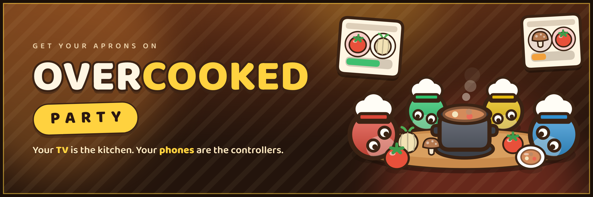
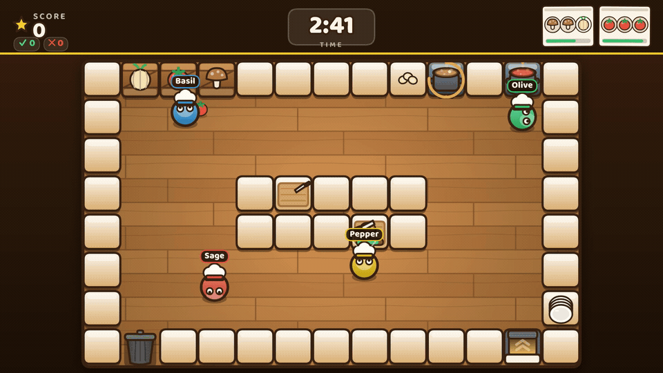

<p align="center">
  
</p>

<h1 align="center">Overcooked Party 🍲</h1>

<p align="center">
  <strong>Your laptop is the console. Every phone in the room is a controller.</strong>
</p>

<p align="center">
  <a href="LICENSE"></a>
  <a href="https://github.com/awlevin/overcooked/actions/workflows/ci.yml"></a>
</p>

---

<p align="center">
  
</p>

<p align="center">
  <em>Two minutes of the real thing: <a href="demo/out/demo.mp4">demo/out/demo.mp4</a></em>
</p>

## Play

Open the game on a laptop, AirPlay or screen-share it to the TV, and let
everyone else scan the QR code. Their phone becomes a gamepad — joystick,
**GRAB**, and **CHOP/DASH**. Up to 8 chefs. Any chef can press **Start**.

**Hosted** — works anywhere, phones only need internet:

> **https://overcooked-bay.vercel.app**

**On your LAN** — offline, lowest latency:

```sh
npm install
npm run build && npm start   # custom server on :3000 (PORT to override)
```

Open the printed `http://<lan-ip>:3000` on the laptop; phones on the same
Wi-Fi scan the QR.

### The game

Grab an ingredient from a crate, chop it on a board (hold **CHOP**), drop 3
chopped ingredients into a pot, wait for the ding, fill a plate from the pot,
and run the soup to the serve window before the order ticket expires. Pots
burn if you ignore them. Rounds are 3 minutes. Full rules and the interaction
table live in [SPEC.md](SPEC.md).

## How it works

A Next.js app with **native WebSockets**, running the same authoritative
simulation in two very different places.

```
phones (/join)                       host laptop → TV (/)
   │ ws: input / press / release        │ ws: state snapshots ~20 Hz
   └──────────────► /api/ws ◄───────────┘
   Vercel Fluid Compute (experimental_upgradeWebSocket)
   or server/local.ts for LAN parties
   realtime/: rooms + authoritative sim @30 Hz + bus (memory | Redis)
```

- **`app/api/ws/route.ts`** upgrades to a WebSocket on Vercel Fluid Compute via
  `experimental_upgradeWebSocket` (`@vercel/functions`). The invocation stays
  alive for as long as the socket does.
- **`server/local.ts`** is a custom Next server for LAN parties. It owns the
  one thing Next cannot do on its own machine — the `/api/ws` upgrade — and
  hands the socket to the same room manager. One process, in-memory bus, no
  external services.
- **`realtime/`** holds transport-agnostic rooms and the authoritative 30 Hz
  sim, which runs inside the host's connection.

### The interesting part: a stateful game on stateless functions

Vercel functions are not a game server, and the design has to absorb that:

- **Every socket dies.** Invocations cap at `maxDuration` (300 s). Clients
  auto-reconnect: the host sends `hello-host {resume:{room}}` to restore its
  room, controllers re-join with their seat `token` and get the same chef —
  name, colour, and whatever they were holding.
- **There is no instance affinity.** A reconnect can land anywhere. The room
  registry, roster, and the latest sim snapshot persist to Redis, snapshots
  are checkpointed ~1/s, and a resumed host rebuilds the `Game` from the
  checkpoint mid-round — the clock never rewinds.
- **A phone can land on a different instance than its host.** Those
  controllers relay input and output over Redis pub/sub.
- **Two instances must never tick one kitchen.** An ownership lease decides
  which instance runs a room's sim, and hands over on host reconnect.

Redis comes from `REDIS_URL` or `KV_URL` (for example Upstash from the Vercel
Marketplace). Without it — local and LAN play — an in-memory registry and bus
do the same job in a single process.

### The rest of the code

- **`game/game.ts` + `shared/levels.ts`** — the pure simulation. No I/O.
- **`components/host/`** — the TV view: canvas kitchen, snapshot
  interpolation, QR lobby.
- **`components/controller/`** — the phone gamepad: pointer-events joystick,
  haptics, wake lock, auto-reconnect.
- **`shared/types.ts` + `shared/protocol.ts`** — the frozen wire contract.

The kitchen, the chefs, and every ingredient are drawn in code on a
`<canvas>`. There are no game sprites on disk.

## Development

```sh
npm install
npm run dev        # custom Next dev server on :3000 (HMR + websockets)
npm run typecheck  # tsc --noEmit, strict
npm run build      # next build
```

Add `?debug` to the host URL for tile coordinates.

### Smoke tests

`npm run smoke` is the end-to-end test: it drives a **running** server over
real WebSockets as one host and three phones, and checks the lobby, join
errors, malformed input, start, snapshots, movement, orders, controller seat
reclaim, and host resume. It never starts a server itself.

```sh
npm run dev                    # in one shell
npm run smoke                  # in another
PORT=3123 npm run smoke        # a server on another port
WS_URL=wss://overcooked-bay.vercel.app/api/ws npm run smoke   # against prod
```

To exercise the multi-instance path — bus relay plus the ownership handover a
Vercel host reconnect causes — run **two** processes sharing one Redis and
point the smoke test at both. Use `npm start`, not `npm run dev`: Next allows
only one dev server per project.

```sh
docker run -d --rm -p 6379:6379 redis:7-alpine
npm run build

export REDIS_URL=redis://localhost:6379
PORT=3131 npm start &
PORT=3132 npm start &

PORT=3131 CROSS_PORTS=3131,3132 npm run smoke
```

CI runs typecheck, build, and the single-process smoke test on every push and
pull request.

## Contributing

Issues and pull requests are welcome — see
[CONTRIBUTING.md](CONTRIBUTING.md) for setup, the smoke-test bar for realtime
changes, and the rules of the wire contract.

## License

[MIT](LICENSE) © 2026 Aaron Levin.

### Disclaimer

**This is a fan-made homage, built for fun.** It is **not affiliated with,
endorsed by, or associated with Ghost Town Games or Team17**, the creators and
publisher of *Overcooked*. No assets from the original game are used here —
every sprite, tile, and chef is original art drawn in code on an HTML canvas.
*Overcooked* and all related trademarks belong to their respective owners.
